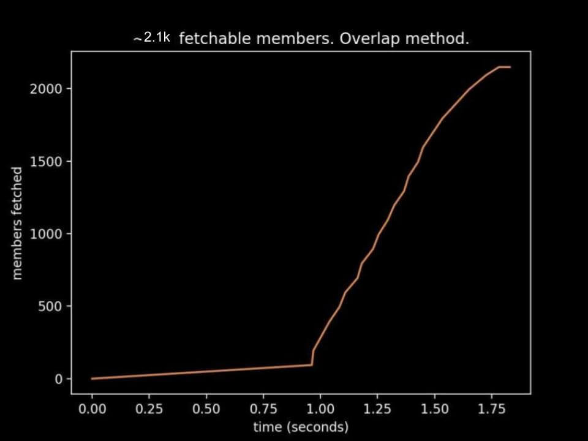
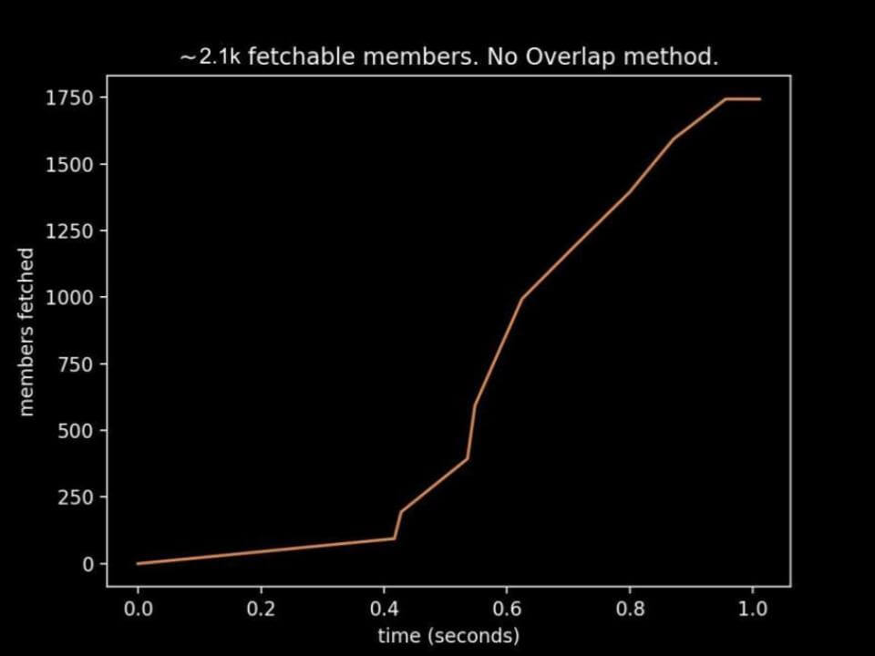
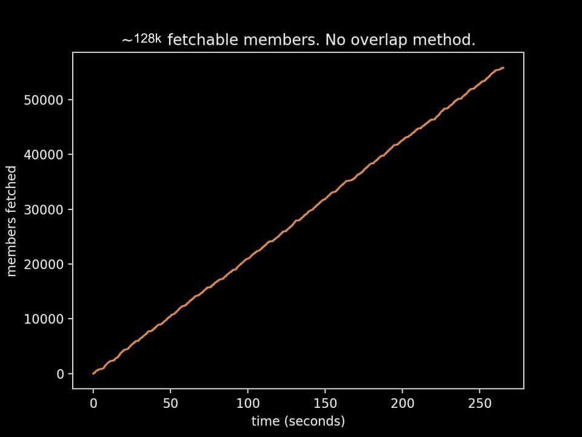

# Fetching Guild Members
Alright so this really needs a page of its own because it's special. There's no actual api endpoint to get the guild members, so instead you have 2 options:    
1)  fetch the member list sidebar (bot.gateway.fetchMembers, which uses opcode 14)
    - when to use: if you can see any categories/channels in the guild
    - pro: fast
    - con: for large servers (```bot.gateway.session.guild('GUILD_ID').large == True```), only not-offline members are fetched
     
2)  search for members by query (bot.gateway.queryGuildMembers, which uses opcode 8)      
    - when to use: if you cannot see any categories/channels in the guild
    - pro: can potentially get the entire member list, can scrape members from multiple guilds at the same time
    - con: slow af (speed is dependent on brute forcer optimizations)

sidenote, here's an example of combining op14 and op8 member fetching: https://pastebin.com/4N8fPipY
____________________________________
# Links/Table of Contents
- [fetch the member list sidebar (faster, but less members)](#fetch-the-member-list-sidebar)
  - [Usage](https://github.com/Merubokkusu/Discord-S.C.U.M/blob/master/docs/using/Gateway_Actions.md#gatewayfetchmembers)
  - [Algorithm](#Algorithm)
  - [How many members can I fetch?](#how-many-members-can-i-fetch)
  - [Examples](#Examples)
  - [Efficiency & Effectiveness](#efficiency--effectiveness)
  - [POC: fetching the memberlist backwards](#fetching-the-member-list-backwards)
- [search for members by query (slower, but more members)](#search-for-members-by-query)
  - [Usage](#Usage)
  - [Algorithm](#Algorithm-1)
  - [How many members can I fetch?](#how-many-members-can-i-fetch-1)
___________________________________
## Fetch the Member List Sidebar
#### Algorithm
1) load guild data (send an op14 with range [0,99]). If the guild is unavailable, discord will send over a GUILD_CREATE event.
2) subscribe to a list of ranges in member list sidebar.
3) after a GUILD_MEMBER_LIST_UPDATE is received, update the saved member list data and subscribe to a new list of ranges

note: 
- you don't have to wait for a GUILD_MEMBER_LIST_UPDATE event to send the next list of member ranges, that's just how discum does it to better mimic the client
- there're 2 methods to fetch the member list: 
    - overlap. Ranges subscribed to (in order) are:
      ```
      [[0,99], [100,199]]
      [[0,99], [100,199], [200,299]]
      [[0,99], [200,299], [300,399]]
      ...
      ```
    - nonoverlap. Ranges subscribed to (in order) are:
      ```
      [[0,99], [100,199]]
      [[0,99], [200,299], [300,399]]
      [[0,99], [400,499], [500,599]]
      ...
      ```
- more info: https://arandomnewaccount.gitlab.io/discord-unofficial-docs/lazy_guilds.html

#### How many members can I fetch?
Even though it's not yet known how discord calculates this, you can still come up with a "ground truth" number. The steps are as follows:
1) open your browser's dev tools (chrome dev tools is a favorite)
2) click on the network tab and make sure you can see websocket connections
3) go to a guild and scroll all the way down on the member list
4) see what are the ranges of the last gateway request your client sends (the # of fetchable members is somewhere in these ranges)

#### Examples
all examples shown use the "overlap" method

while the gateway is running:
```python
import discum
bot = discum.Client(token='ur token')

@bot.gateway.command
def memberTest(resp):
	guild_id = '322850917248663552'
	channel_id = '754536220826009670'
	if resp.event.ready_supplemental:
		bot.gateway.fetchMembers(guild_id, channel_id) #put wait=1 in params if you'd like to wait 1 second inbetween requests
	if bot.gateway.finishedMemberFetching(guild_id):
		lenmembersfetched = len(bot.gateway.session.guild(guild_id).members)
		print(str(lenmembersfetched)+' members fetched')
		bot.gateway.removeCommand(memberTest)
		bot.gateway.close()

bot.gateway.run()

for memberID in bot.gateway.session.guild('322850917248663552').members:
	print(memberID)
```
before the gateway is run:
```python
import discum
bot = discum.Client(token='ur token')
guild_id = '322850917248663552'
channel_id = '754536220826009670'
bot.gateway.fetchMembers(guild_id, channel_id) #put wait=1 in params if you'd like to wait 1 second inbetween requests
@bot.gateway.command
def memberTest(resp):
	if bot.gateway.finishedMemberFetching('322850917248663552'):
		lenmembersfetched = len(bot.gateway.session.guild('322850917248663552').members)
		print(str(lenmembersfetched)+' members fetched')
		bot.gateway.removeCommand(memberTest)
		bot.gateway.close()

bot.gateway.run()

for memberID in bot.gateway.session.guild('322850917248663552').members:
	print(memberID)
```
It's possible that fetchMembers doesn't fetch all not-offline members due to rate limiting. Don't worry if this happens, you can start fetching members from any index. (discum calculates ranges using index x multiplier; the index used below is 50 and the multiplier used is 100, so the fetching starts at 50x100 = 5000th member):
```python
#import discum
#bot = discum.Client(token='ur token')
guild_id = '322850917248663552'
channel_id = '754536220826009670'
bot.gateway.fetchMembers(guild_id, channel_id, method="overlap", startIndex=50, reset=False) #overlap method means multiplier is 100, reset is False because you want to keep previous data
@bot.gateway.command
def memberTest(resp):
	if bot.gateway.finishedMemberFetching('322850917248663552'):
		lenmembersfetched = len(bot.gateway.session.guild('322850917248663552').members)
		print(str(lenmembersfetched)+' members fetched')
		bot.gateway.removeCommand(memberTest)
		bot.gateway.close()

bot.gateway.run()

for memberID in bot.gateway.session.guild('322850917248663552').members:
	print(memberID)
```
[Want a function that returns the member list? No worries.](https://github.com/Merubokkusu/Discord-S.C.U.M/blob/master/examples/gettingGuildMembers.py)


#### Efficiency & Effectiveness

|      | overlap&nbsp; &nbsp; &nbsp; &nbsp; &nbsp; &nbsp; &nbsp; &nbsp; &nbsp; &nbsp; &nbsp; | no overlap |
|------|---------|------------|
| 2.1k |    |       |
| 128k |    |       |

As you can see, the "no overlap" method fetches 200 members/second while the "overlap" method fetches 100 members/second. However, "no overlap" is also a lot less effective. After doing a few more tests with both methods ("overlap" and "no overlap"), "no overlap" shows a lot less consistency/reliability than "overlap".


#### Fetching the member list backwards
(and in pretty much any "style" you want)       
So, this is more proof-of-concept, but here's a short explanation.         
Suppose you're in a guild with 1000 members and want to fetch the member list backwards (I dunno...more undetectable since noone fetches it backwards? lol).        
   Since discum requests members in 200-member chunks, you'll either have to request for the following range groups (safer):        
   ```
   [[0,99],[800,899],[900,999]] #target start: 800
   [[0,99],[700,799],[800,899]] #target start: 700
   [[0,99],[600,699],[700,799]] #target start: 600
   [[0,99],[500,599],[600,699]] #target start: 500
   [[0,99],[400,499],[500,599]] #target start: 400
   [[0,99],[300,399],[400,499]] #target start: 300
   [[0,99],[200,299],[300,399]] #target start: 200
   [[0,99],[100,199],[200,299]] #target start: 100
   [[0,99],[100,199]] #target start: 0
   ```
   or the following range groups (faster):        
   ```
   [[0,99],[800,899],[900,999]] #target start: 800
   [[0,99],[600,699],[700,799]] #target start: 600
   [[0,99],[400,499],[500,599]] #target start: 400
   [[0,99],[200,299],[300,399]] #target start: 200
   [[0,99],[100,199]] #target start: 0
   ```
   The first one looks like an overlap method while the second looks like a no-overlap method. However, since we're fetching the memberlist backwards, we cannot   
   use 100 and 200 for the methods. Instead, we need a list of multipliers (method) and a startIndex.         
   To easily calculate these params, either do this:        
   ```startIndex, method = bot.gateway.getMemberFetchingParams([800, 700, 600, 500, 400, 300, 200, 100, 0])```        
   or        
   ```startIndex, method = bot.gateway.getMemberFetchingParams([800, 600, 400, 200, 0])```        
   depending on how to want to request for members.        
   Then, simply do         
   ```
   bot.gateway.fetchMembers("guildID","channelID",startIndex=startIndex, method=method)
   bot.gateway.run()
   ```
____________________________________
## Search for Members by Query
#### Usage
1) copy the code for [discum's example op8 brute forcer](https://github.com/Merubokkusu/Discord-S.C.U.M/blob/master/examples/searchGuildMembers.py#L31)
2) run the function:
  ```python
  bot.gateway.command({"function": bruteForceTest, "params":{"guildID":'1010101010101010', "wait":1}})
  ```
  A wait time of at least 0.5 is needed to prevent the brute forcer from rate limiting too often. In the event that the brute forcer does get rate limited, some time will be lost reconnecting (the brute forcer should just start from where it left off).
#### Algorithm
for simplicity, assume that the list of characters to search for is ['a', 'b', 'c', 'd']
1) query for up to 100 members in guild who have a nickname/username starting with 'a'
2) on a GUILD_MEMBERS_CHUNK event:
    - if there are 100 results:
        - add on the 2nd character of the last result. For example, if the results are
            ```
            aaaaaaaaaaaa
            aaadfd3fgdftjh
            ...
            Acaddd
            ``` 
            , 
            the next query will be 'ac'. Note: searches are case-insensitive and consecutive spaces are treated like single spaces.
    - if there are less than 100 results:
        - replace the last index of the query with the next option in the list

This algorithm can definitely be made a lot better so have at it. The brute forcer example is just there to help you get started.

#### How many members can I fetch?
- if no member-viewing perms
  - a limit is posed if many users have the same nickname & username (but different discriminators). Only the 1st 100 members will be able to be fetched. There's no known way to include the discriminator # in the search.
  - also, in order to query users with fancy characters in their username/nickname, the op8 brute forcer needs to be slowed down (cause, more characters to search)
- if member-viewing perms
  - no limit. You can fetch all the members:
    ```python
    @bot.gateway.command
    def test(resp):
    	if resp.event.ready_supplemental:
    		bot.gateway.queryGuildMembers(['guildID'], '', limit=0, keep="all")
    	if resp.event.guild_members_chunk and bot.gateway.finishedGuildSearch(['guildID'], ''):
    		bot.gateway.close()

    bot.gateway.run()
    ```
    If the above doesn't work, set the limit parameter to 10000.
